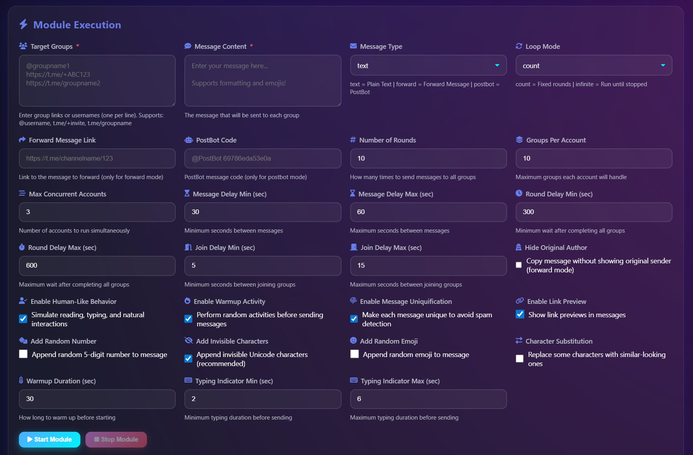
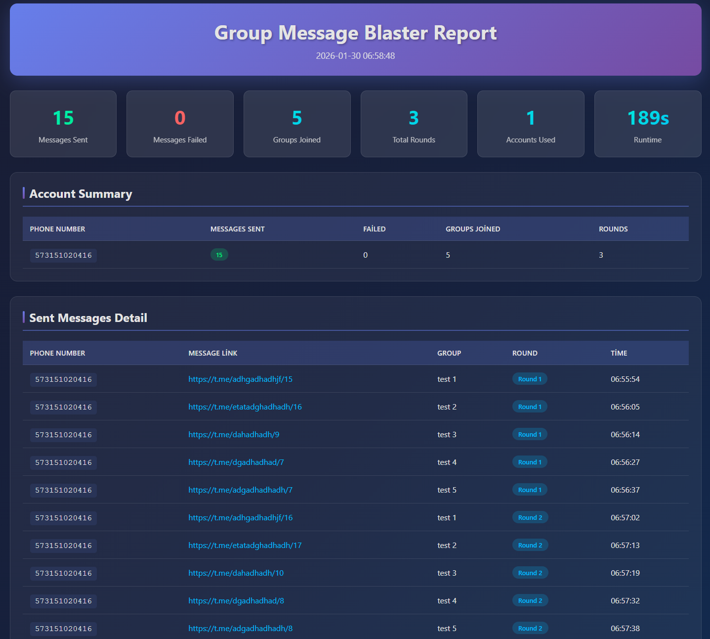

# Telegram Shill Bot & Auto Forward Bot

## 🚨 CONTACT & ACCESS (IMPORTANT)

### 👉 Get access to the **Telegram Shill Bot**, **Telegram Shilling Service**, and Auto Forward tools  
### 👉 **Official Telegram Support:**  
## 🔗 https://t.me/GrowthStudioSupport

> Contact us on Telegram for access to **Telegram Shilling Bots**, **Shill Bot Telegram**, and advanced message forwarding automation.

---

A professional **Telegram Shill Bot** and **Telegram Auto Forward Bot** solution designed for automated message distribution, shilling campaigns, and cross-group/channel forwarding.

This repository demonstrates how a **Telegram Shilling Bot** and a **Telegram Bot That Forwards Messages** work together for scalable Telegram automation.

---

## 🚀 What is a Telegram Shill Bot?

A **Telegram shill bot** is an automation tool used to distribute promotional or informational messages across multiple Telegram groups and channels.

Using **telegram shilling bots**, you can:
- Run automated shilling campaigns
- Act as a Telegram shiller across many groups
- Deliver messages consistently without manual effort

Commonly searched as:
- Shill bot Telegram  
- Shilling bot Telegram  
- Telegram shiller  
- Telegram shiller bot  

---

## 🎛️ Image – Telegram Shill & Forward Bot Control Panel

> Control panel showing message templates, delay settings, group/channel targets, forwarding rules, and automation status for **Telegram Shilling Bots** and **Telegram Auto Forward Bot**.

---

## 🧩 Telegram Shilling Bot & Service Overview

A **Telegram shilling bot** is often paired with a **Telegram shilling service** to manage:

- Message rotation
- Group targeting
- Delay & rate control
- Long-term campaign execution

These systems are widely known as:
- Telegram shilling bots  
- Telegram shilling service  
- Shilling bot Telegram  

---

## 🔁 Telegram Auto Forward Bot – Message Forwarding Automation

A **Telegram auto forward bot** is a **Telegram bot that forwards messages** automatically between chats.

With an **auto forward Telegram bot**, you can:
- Forward messages from one group to many
- Forward channel posts automatically
- Run cross-posting automation

This functionality is also referred to as:
- Auto forward bot Telegram  
- Bot forward message Telegram  
- Forwarding bot Telegram  
- Telegram bot forward message  

---

## ⚙️ Telegram Forwarder Software & Apps

The automation stack can include:
- Telegram auto forward app solutions
- Telegram auto forward bot logic
- Telegram forwarder software for large-scale operations

These tools ensure reliable delivery while respecting Telegram limits.

---

## 🎥 Video – Telegram Shill & Auto Forward Tutorial

> This tutorial demonstrates how a **Telegram shill bot** and **Telegram auto forward bot** operate in real-world scenarios.

---

## 🖼️ Workflow & Use Cases

Typical workflows include:
- Telegram shilling bot campaigns
- Automated forwarding bot Telegram setups
- Bot forward message Telegram pipelines
- Multi-group shilling automation

These workflows are commonly powered by **Telegram shilling bots** combined with **Telegram forwarder software**.

---

> Post-campaign report displaying forwarded messages, shilling activity, success rate, failed deliveries, and campaign duration using **Telegram Shilling Service** and **Telegram Forwarder Software**.

---

## 🛡️ Safety & Best Practices

- Smart delays & throttling
- Group rotation
- Message variation
- Long-term safe shilling patterns

Proper configuration ensures your **Telegram shill bot** and **auto forward Telegram bot** operate safely.

---

## 📩 Contact & Support

### 🔗 Telegram Support:  
## https://t.me/GrowthStudioSupport

> Access to the **Telegram Shilling Bot**, **Telegram Shilling Service**, and **Telegram Auto Forward Bot** is provided privately.

---

## ⭐ Disclaimer

This repository is for educational and demonstration purposes only.  
Actual **Telegram shill bot**, **Telegram shilling bots**, and **Telegram forwarder software** are distributed privately.

**Telegram Shill Bot & Auto Forward Bot – Automated. Controlled. Scalable.**
